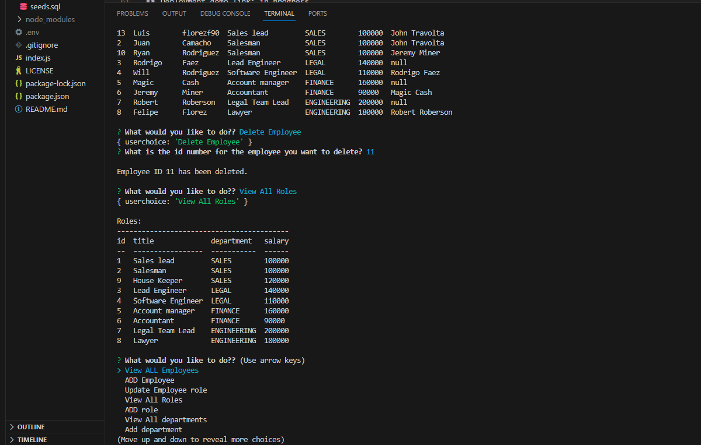

<h1 align= "center" id="title">employer Data-base </h1>

     

  # 👩‍💻 About

The present application is being desgined with the intention of showcasing MySQL skills while being able to provide interactivity, by simulating the database of a generic company;
and allowing the user to modify core information from the database such as:

* View employees | departments | roles | salaries.

* Delete employees | departments | roles.

It's important to mention that  as of 11/15/2023, the present code is not completed at all, there are compatibility issues between inquirer and mysql2 packages, that is making impossible to
intertact with the database from the command line by running JS code.

IMPORTANT UPDATE: 11/17/2023 the application has been fixed by approaching the missmatch among the passwords for the database and MySQL server.

  
 📊 Table of Contents 

  <ol>
    <li>
      <a>About The Project</a>
        <li><a>Built With</a></li>
    </li>
    <li><a>Installation</a></li>
    <li><a >Usage</a></li>
    <li><a >Contributing and Contact</a></li>
    <li><a >Acknowledgments</a></li>
    <li><a >License</a></li>
  </ol>

---------
# 💲Built With 

 List of any major frameworks/libraries used to design the project: 

* 

* 

* 

* 

*  

---------------------------------

# 🚀 Installation 

💿 Deployment demo link: https://drive.google.com/file/d/1qh414LuJnsklulfHF_dfRViQetSM4rHA/view

This app is meant to be used in a local envirioment, this is how:

For installation onto local machine, clone provided repository by following the next steps:

 
      git clone https://github.com/florezf90/Employer-DATABASE.git

2.Second, initialize the node package and accept the defaults by running: 
 
        npm i
 
   
3.Then, run `node index.js` in order to get started with the prompts and interact with the database.

NOTE: the above image is a demo of the application working properly in the command line.

  
 -----------------------------
 # 📖 Usage

  Once the repo and the NPM Inquirer has been installed, the application will start by running :
  
      node index.js
   

-------- 

# 📱 Contributing and Contact 

If you have a suggestion that would make this better, don't hesitate to reach me out and create a pull request. You can also simply open an issue with the tag "enhancement". Don't forget to give the project a star! Thanks again!

 ✉️ mail: florezf90@gmail.com

 

 💿 Demo: https://drive.google.com/file/d/1qh414LuJnsklulfHF_dfRViQetSM4rHA/view

-----

 # 🔒🔑 License
 
Distributed under the MIT License. See LICENSE.txt for more information.

## [🔝](#title)

[linkedin-shield]: https://img.shields.io/badge/-LinkedIn-black.svg?style=for-the-badge&logo=linkedin&colorB=555
[linkedin-url]: https://www.linkedin.com/in/luis-felipe-florez-98403123a/

